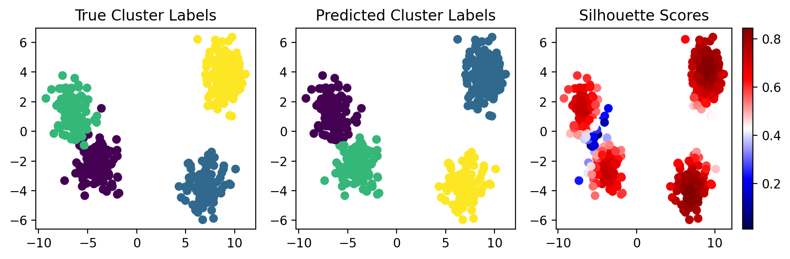

# Assignment 3
Implementation of KMeans and Silhouette Scoring

# Assignment

## Overview
My result:


## Get Started 

### Tutorial


```python
>>> from cluster import KMeans 
# Initialization
>>> new = KMeans(k)

# Fit data into the model
>>> new.fit(your_data)

# Prediction
>>> your_labels = new.predict(your_data)

#Scoring
>>> calculated_scores = silhouette.Silhouette()
>>> calculated_scores.score(X = your_data, y = your_labels)

#Plot
>>> plot_multipanel(your_data, real_labels, your_labels, calculated_scores.perpointscore)
```

### Grading (Total: 10)
* KMeans implementation (4)
  * Implements Lloyd's Algorithm correctly (2)
  * Correctly exits on iteration number or tolerance (1)
  * Functionality is reasonable on test data (1) 
* Silhouette implementation (2)
  * Silhouette score  correctly implemented (1)
  * Silhouette score is reasonably close to sklearn implementation (1)
* Unit tests (2)
* Handles edge cases/error checks (1) 
* Code readability (1)
* Extra credit (1)
  * Github actions/workflow (up to +0.5)
  * kmeans++ implementation (up to +0.5)
